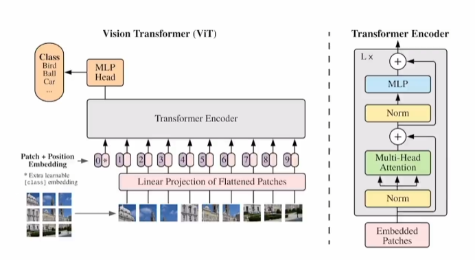

# 1 ViT解决了什么，怎么做

在提出transformer后，cv领域也想应用transformer。transformer的复杂度是n²，所以降低输入的复杂度是一个很重要的问题。ViT之前，主流的方法是：

1.将一个图片中的每个像素都作为一个token（复杂度极高，不可能这样）

2.轴注意力：先在行上做自注意力，再在列上做自注意力

3.选取一些点作为token

但是因为他们自己提出的方法没有专门的硬件加速，计算很慢，很难做出10亿参数级别的大模型。ViT是想直接利用transformer，尽量把改进放在输入处理方面：

1.把一张图片切割成很多小块，每个小块作为一个token，经patch+position embading转成输入（每个patch变成一个词向量，一张图变成一组词向量了）

2.混合模型，用cnn提取特征图，从而获取patch，而非直接切割

从而保持在transformer模型不变的情况下，直接处理图像，实现了transformer模型大一统nlp和cv

# 2 ViT的特点

在训练集比较小的情况下，不如cnn模型，原因是缺少先验信息：locality（假设图片上相邻区域中有相邻的特征）和平移等变性（先平移还是先卷积不影响结果）

但是在大数据集上，效果极好，而且对比其他大模型，训练的很快