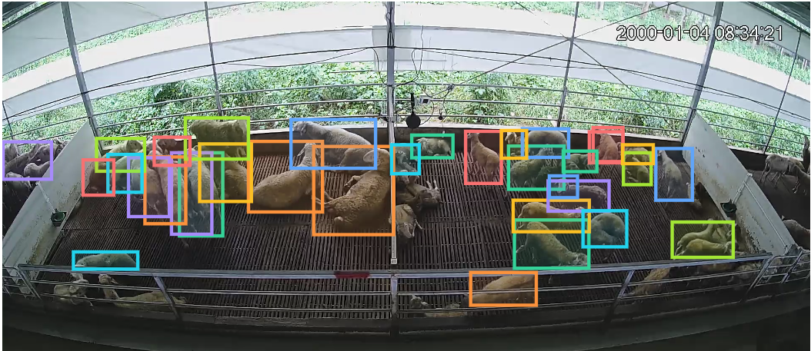

# DETR:一种端到端的目标检测方法

优势：

1.引入了端到端，从而可以简化框架，便于调参以及部署

2.引入了transformer，可以很好的进行全局建模，实现对大物体的良好检测。但是对小物体检测不好，并且训练慢（后续在系列论文中利用多尺度特征、针对性的检测头，都解决了）

3.拓展性很好，在目标追踪、视频领域的姿态预测、语义分割上都效果很好。就像clip一样


每个框中填的是框准确度和分类loss之和，然后利用匈牙利算法，计算出最佳匹配

再对匹配好的框，计算loss进行反向传播


具体实现代码如下：

```python
import torch
from torch import nn
from torchvision.models import resnet50

class DETR(nn.Module):
    def __init__(self, num_classes, hidden_dim, nheads,
        num_encoder_layers, num_decoder_layers):
        super().__init__()
        # We take only convolutional layers from ResNet-50 model
        self.backbone = nn.Sequential(*list(resnet50(pretrained=True).children())[:-2])
        self.conv = nn.Conv2d(2048, hidden_dim, 1) # 1×1卷积层将2048维特征降到256维
        self.transformer = nn.Transformer(hidden_dim, nheads, num_encoder_layers, num_decoder_layers)
        self.linear_class = nn.Linear(hidden_dim, num_classes + 1) # 类别FFN
        self.linear_bbox = nn.Linear(hidden_dim, 4)                # 回归FFN
        self.query_pos = nn.Parameter(torch.rand(100, hidden_dim)) # object query
        # 下面两个是位置编码
        self.row_embed = nn.Parameter(torch.rand(50, hidden_dim // 2))
        self.col_embed = nn.Parameter(torch.rand(50, hidden_dim // 2))

    def forward(self, inputs):
        x = self.backbone(inputs)
        h = self.conv(x)
        H, W = h.shape[-2:]
        pos = torch.cat([self.col_embed[:W].unsqueeze(0).repeat(H, 1, 1),
       					 self.row_embed[:H].unsqueeze(1).repeat(1, W, 1),
       					 ], dim=-1).flatten(0, 1).unsqueeze(1) # 位置编码
       					 
        h = self.transformer(pos + h.flatten(2).permute(2, 0, 1),self.query_pos.unsqueeze(1))
        return self.linear_class(h), self.linear_bbox(h).sigmoid()


detr = DETR(num_classes=91, hidden_dim=256, nheads=8, num_encoder_layers=6, num_decoder_layers=6)
detr.eval()
inputs = torch.randn(1, 3, 800, 1200)
logits, bboxes = detr(inputs)
```


可以观察到，即使在严重遮挡的情况下，每个物体边界的注意力还能区分开来，如大象尾巴、象腿等处。而且两头象的皮肤还有斑马上的花纹都差不多，但是轮廓都分的很清楚。作者认为这是 Decoder 在区分不同物体边界的极值点（extremities），在 Encoder 能够区分开不同的物体之后，Decoder 就只需要关注物体的边界位置，解决遮挡这些问题，最终精准地预测出不同物体的边框位置。


在羊舍数据上试了一下，不过不能分辨具体的动作，因为他们用的是coco数据集训练，只能认出来sheep

