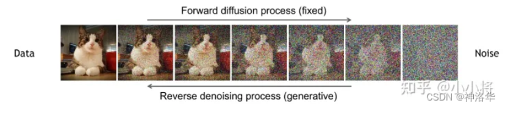
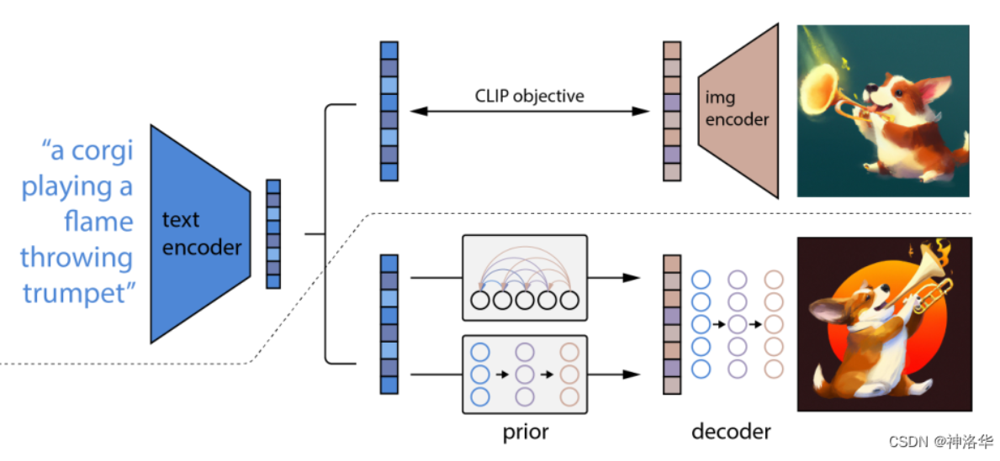
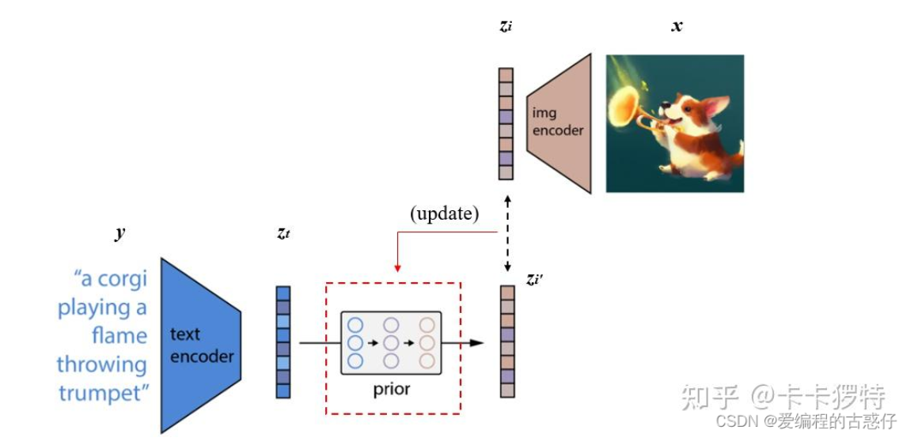

看了前置的ae，dae，vae，然后是diffusion

# DDPM:图生图

扩散就是增加噪声的过程

生成就是降低噪声的过程

ddpm为了降低计算量，从预测图转变为预测噪声

这个过程就是很多公式的计算，推导的公式很复杂，但是用深度学习网络可以拟合任何函数

训练出网络后，从而实现了图生图

# DALL·E2：文生图

OpenAI直接利用clip学习到的很好的图文特征，去做文生图

DALL·E2是一个两阶段的生成，首先对文本编码器抽出来的特征，用prior生成一个图像特征

再对prior生成的图像特征，利用解码器生成图像，下为prior的训练过程

decode的训练：

把预测图像，和真实图像直接做loss即可

