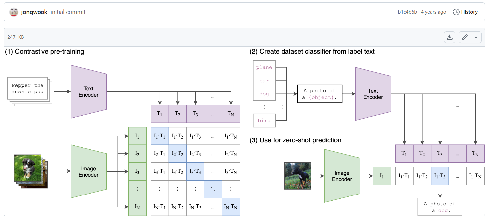
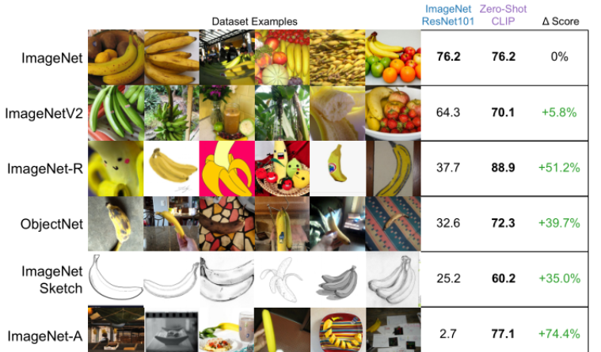
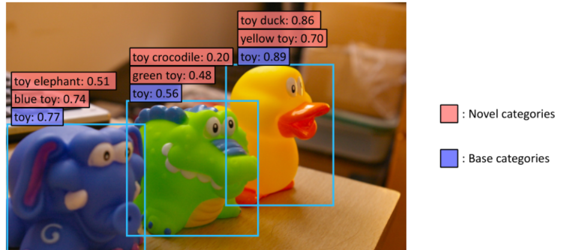
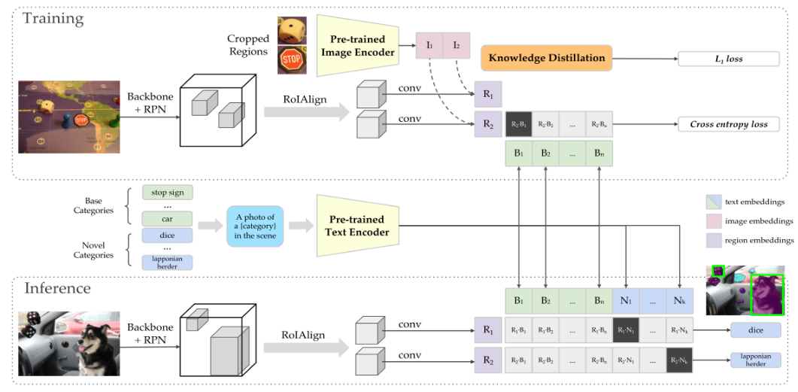
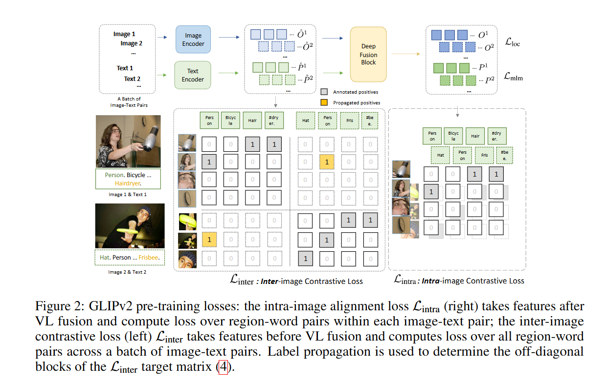
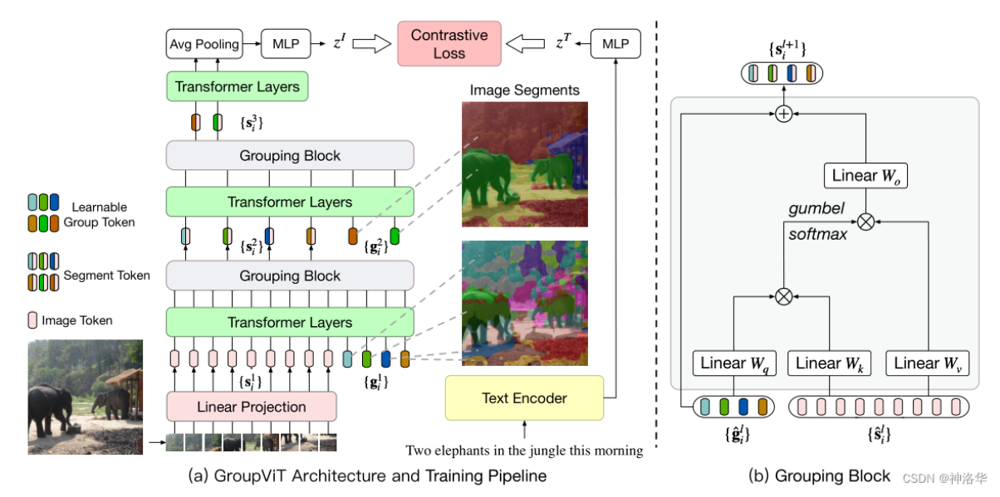

# 1 CLIP图像分类

CLIP全称Constrastive Language-Image Pre-training，是OpenAI推出的采用对比学习的文本-图像预训练模型。CLIP惊艳之处在于架构非常简洁且效果好到难以置信，在zero-shot文本-图像检索，zero-shot图像分类，文本-图像生成任务guidance，open-domain 检测分割等任务上均有非常惊艳的表现。

CLIP模型在不使用ImageNet数据集的任何一张图片进行训练的的情况下，最终模型精度能跟一个有监督的训练好的ResNet-50打成平手，精度为76.2%。



先分别对图像和文本提特征，这时图像对应生成 I1、I2 ... In 的特征向量，文本对应生成T1、T2 ... Tn 的特征向量，然后中间对角线为正样本，其余均为负样本。这样的话就形成了n个正样本，n^2 - n个负样本。一旦有了正负样本，模型就可以通过对比学习的方式训练起来了，完全不需要手工的标注。这样模型的训练过程就是最大化n个正样本的相似度，同时最小化n^2 - n个负样本的相似度。自监督的训练需要大量的数据，OPEN AI的这个训练数据量大约在4亿个的数量级。




```python
from modelscope.preprocessors.image import load_image
import torch
import numpy as np
def clip_demo(input_img,input_texts):
    from modelscope.pipelines import pipeline
    from modelscope.utils.constant import Tasks
    pipeline = pipeline(task=Tasks.multi_modal_embedding,
        model='damo/multi-modal_clip-vit-large-patch14_336_zh', model_revision='v1.0.1')
    # 支持一张图片(PIL.Image)或多张图片(List[PIL.Image])输入，输出归一化特征向量
    img_embedding = pipeline.forward({'img': input_img})['img_embedding'] # 2D Tensor, [图片数, 特征维度]

    # 支持一条文本(str)或多条文本(List[str])输入，输出归一化特征向量
    text_embedding = pipeline.forward({'text': input_texts})['text_embedding'] # 2D Tensor, [文本数, 特征维度]
    
    # print(img_embedding.shape)
    # print(text_embedding)
    # print(text_embedding.shape)

    # 计算图文相似度
    with torch.no_grad():
        # 计算内积得到logit，考虑模型temperature
        logits_per_image = (img_embedding / pipeline.model.temperature) @ text_embedding.t()
        # 根据logit计算概率分布
        probs = logits_per_image.softmax(dim=-1).cpu().numpy()
    n = np.argmax(probs)
    print("预测类别: ", input_texts[n])
    print("图文匹配概率:", probs)
    
    
    
input_img = load_image('./躺.jpg') 
input_texts = ["站立的羊", "进食的羊", "躺着的羊"]
print("真实类别: 躺")
clip_demo(input_img, input_texts)


input_img = load_image('./吃.jpg') 
input_texts = ["站立的羊", "进食的羊", "躺着的羊"]
print("真实类别: 吃")
clip_demo(input_img, input_texts)

input_img = load_image('./站.jpg') 
input_texts = ["站立的羊", "进食的羊", "躺着的羊"]
print("真实类别: 站")
clip_demo(input_img, input_texts)
```


```
真实类别: 躺
预测类别:  躺着的羊
图文匹配概率: [[0.00992001 0.14901677 0.8410632 ]]
真实类别: 吃
预测类别:  站立的羊
图文匹配概率: [[0.8463575  0.13987164 0.01377088]]
真实类别: 站
预测类别:  进食的羊
图文匹配概率: [[0.4587292  0.5257832  0.01548763]]
```


# 2 CLIP目标检测相关工作：

## 2.1 ViLD



如果用传统的目标检测算法的话，模型只会判断这些物体都是玩具，也就是图中蓝色的基础类，而无法检测到更细致的类别。使用CLIP之后，在现有检测框上，不需要额外标注，就可以检测出新的类（图中红色标识类）。

通俗的来说，把每个框当成一个图片，然后利用clip进行zero-shot进行分类。如果是在师兄的数据上，就是对每个框的羊当成一个图，然后再判断具体的类别。

```python
import numpy as np
import torch
import clip
from PIL import Image

device = "cuda" if torch.cuda.is_available() else "cpu"
model, preprocess = clip.load("ViT-B/32", device=device) # 加载base模型

image = preprocess(Image.open("一群羊.png")).unsqueeze(0).to(device)
text = clip.tokenize(["喝水的羊","吃饭的羊", "躺着的羊", "站着的羊"]).to(device)

with torch.no_grad():
    image_features = model.encode_image(image)
    text_features = model.encode_text(text)
    
    logits_per_image, logits_per_text = model(image, text) # 计算图文特征相似性
    probs = logits_per_image.softmax(dim=-1).cpu().numpy() # 和图片最相似的文本就是图片的类别

print("Label probs:", probs) 

Label probs: [[0.3131486  0.3174914  0.08763372 0.28172636]]
```

整体的流程图如下，具体实现上，还是想直接利用OpenAI训练的很好的预训练权重，所以图像编码方面增加了一个知识蒸馏，让本网络的图像编码部分去学习clip的特征：



## 2.2 GLIP

目标检测的标注数据集很贵，对于边边角角的类和层出不穷的新类，我们没有办法训练一个模型把这些都检测的很好。针对现有目标检测数据集难收集，数量少且昂贵的问题，尽可能采用比较便宜，容易获取的图片-文本对（轻轻松松就能获取上亿对），进行对比学习。

上面的ViLD感觉就是在目标检测框上加了一层clip，先定位再分类。

而这个glip，就是把clip替换了一下，变成了一个deep fusion块，定位和分类同时进行。由于基础课部分，还没学到目标检测，所以对定位还不太理解，暂时先不介绍了。



# 3 CLIP分割相关工作

## 3.1 GroupViT

上面都是对图像整体进行分类的，这篇是进行像素级分类的工作。



实验结果表明，可以很好的进行图像分割，但是进行语义分割的时候有问题，会将分割好的类归错语义。原因还是数据的问题，本文是直接利用的clip预训练模型，没有对文本编码器进行微调，不能识别出背景是什么意思，因此造成语义分割错误。
