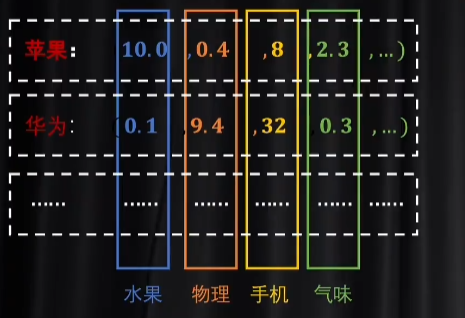

# 0 Transformer

transformer模型最初是为nlp中机器翻译任务设计的，解决了rnn不能并行计算和不能很好地学习到全局信息的问题。

transformer模型越大，参数越多，效果也越好，因此不需要针对某类问题单独设计模型，实现了多任务的大统一。目前被广泛应用于很多领域，并且能取得很好的效果。

# 1 token数字化：编码方式

分词器（投射到一维向量中），解决了token数字化，信息密度太密集，容易体现token间的联系，其仅把token间的语义关系变成了长度问题，完全没有利用维度关系。

one-hot（投射到高位空间中），解决了token数字化，信息密度太稀疏，很难体现token间的联系，其仅把token间的语义关系变成了维度问题，完全没有利用长度关系。

---

# 2 词嵌入：解决单个token语义的问题

为了结合上述两种方式的优点。可以基于分词后的ID去升维，也可以基于one-hot编码去降维。

由于降维比升维度更容易，可以对ont-hot降维，从而获得一个潜空间（也就是隐藏层，one-hot编码已经变成了词向量，可能具有各种不同的意义），这个过程叫做embeding

# 3 word2vec：词嵌入的训练

CBOW方法：输入一组奇数n个token， 拿走其中一个token，用另外n-1个token分别与同一个嵌入矩阵相乘，变成潜空间中的词向量，再把这n-1个词向量加在一起合成一个向量，最后对这个合向量进行解码，利用损失函数去比较解码出的和缺失的token是不是一样的，从而更新参数，完成一轮训练

Q1:为什么把另外n-1个词向量加在一起，就应该得到缺失token的词向量呢？

W1:若只能从文本中理解一个token的语义，那就能且只能根据其上下文去理解。反之，有了上下文，也能确认缺失token的语义。

Q2:这是一个XX苹果，xx处应该填什么呢？红、甜、好不都行么

W2:无所谓。word2vec只是训练出潜空间的词向量，起到一个词典的作用，用一些词解释一个词。至于具体使用哪个，如何组合，由注意力去负责

# 4 相对位置编码

输入一组词向量并行计算的同时，还能体现出先后顺序，有两种方法，一个是通过权重（乘法）增加位置信息，一个是通过偏置系数（加法）增加位置信息。原论文中是利用加法，即对词向量矩阵加上一个P矩阵。

# 5 自注意力

从nlp方向进行理解：输入一组词向量，经过三个矩阵Wq、Wk、Wv相乘，得到Q、K、V三个矩阵，再经过一些运算，输出一组词向量。

Q1:矩阵A是什么？

W1:矩阵A只是Q与K转置的相乘，但是根据运算法则，我们可以知道A中每个元素都是表示不同词向量间的关系，如正数为正相关，0为无关，负数为负相关。在经过softmax后归一化到0-1之间

Q2:A'和V相乘的意义

W2:A'作为一个表，保存了不同词向量间的关系。通过与V相乘，实现对上下文语义的理解，从而为多个词向量叠加时增加了主观性，即注意力。

Q3:为什么一定要有Q和K,为什么不直接去算出A呢？

W3:Q和K可以从不同角度理解上下文，这意味着更强的非线性，更强的泛化性，可以让模型表达更复杂的情况

# 6 多头注意力

其实就是多个单头注意力的结果拼接在一起，再乘一个W矩阵，获得一个词向量组

# 7 交叉注意力

transformer中除了多头注意力外，其实还有一个交叉注意力，其实只是改变了输入数据导致了Q和K的来源不同，其他部分还是没有改变的

