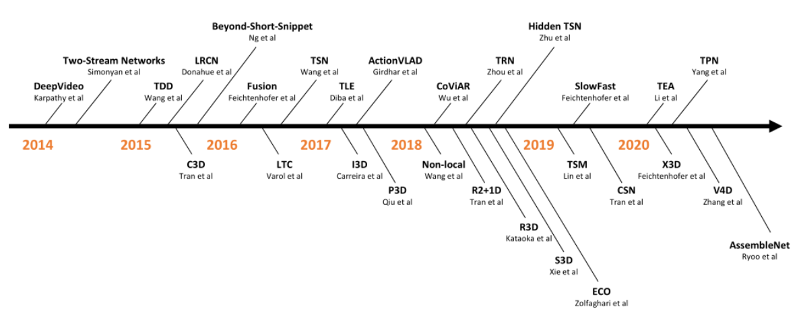
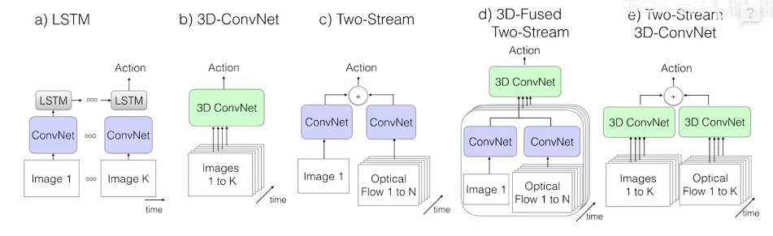
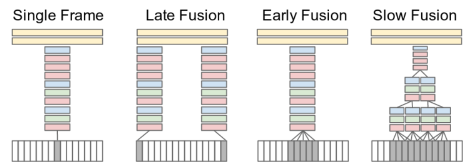
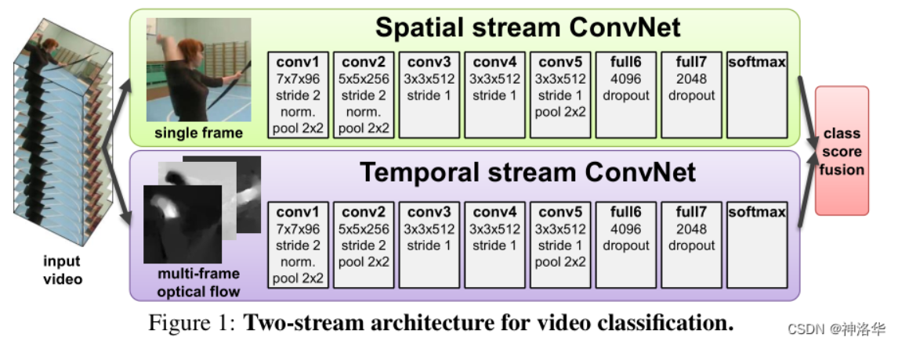

# 发展

# 按类型分

# 最单纯的cnn

这一类主要是DeepVideo时期，是非常早期的方法，主要是从对帧的处理上入手

# a LSTM类

就是把视频的每个帧，都用同一个CNN模型提取出特征，然后按照时序放入LSTM中

# b 3DCNN

把二维cnn模型的卷积核，升维到3d，然后就可以直接处理视频中的时序

主要是可以把纯cv的一些方法直接应用到视频理解中了

# c 双流模型

3dcnn直接学习动作效果不好，于是利用两个模型，一个用来学习图像特征，一个用了从光流图中学习运动特征

下面是光流图的可视化，可以看出，光流图可以很好的表达运动特征

# d 融合3dcnn和双流模型

只是把双流模型中的2dcnn换成3dcnn

# e 融合lstm和d模型

双流模型主要还是用来处理3-7秒的短视频，对长视频效果不好

通过把视频分段，分别用双流模型提取特征，送到lstm中，从而对长视频有好效果

# 总结

假如是对我们羊动作目标检测的任务，可以吸取光流的思想

想办法把光流图作为输入进去辅助训练，可能会有效果

不过增加输入数据，估计会影响训练速度。而且预测时为了保持一致，肯定也是要计算光流的

毕竟YOLO(You Only Look Once)又快又准，把其当做基准模型，不一定行。。。

